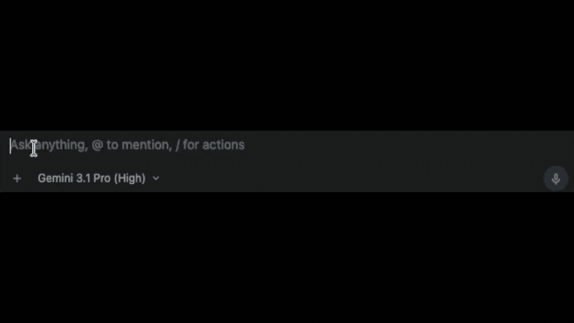
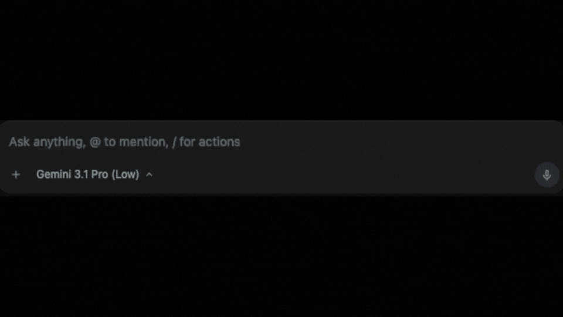
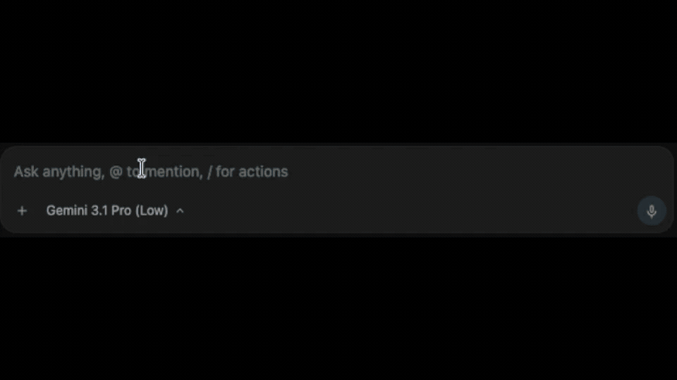
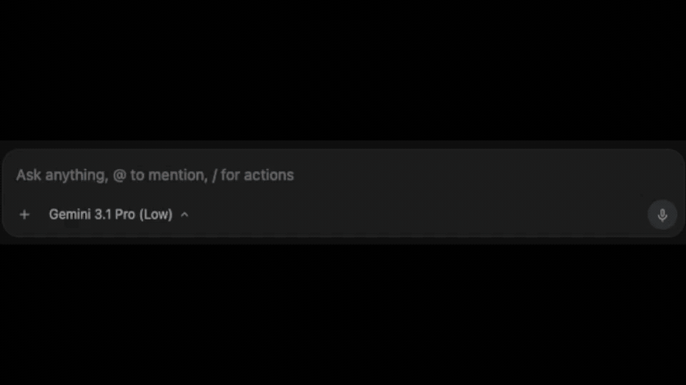
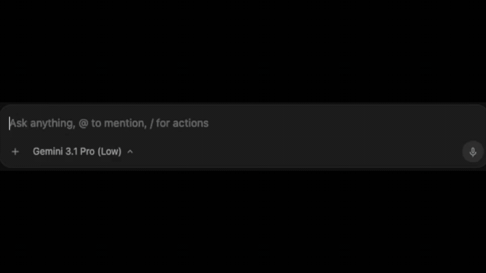

# fls-pilot


[](https://github.com/thunderdew-dawn/fls-pilot/actions/workflows/ci.yml)


[](https://fl-studio-pilot.readthedocs.io/en/latest/)


**Create more. Check less.**

fls-pilot is a local Control Center and workflow assistant for FL Studio. It helps producers stay in the creative flow while reviewing mix, routing, project structure, setup, export readiness, and genre-aware production details.

Built around a safety-first model: scan before changing, explain findings in plain language, ask for explicit approval before persistent project edits, and keep supported writes small, verified, logged, and rollback-capable.

## What It Does

- Reads FL Studio transport, channel, mixer, pattern, playlist, routing, plugin,
  and live meter context through MCP.
- Guides production workflows such as Mix Review, Routing Audit, Project
  Organizer, Project Health, Plugin Chain Planning, and Composition.
- Uses Knowledgebase-backed ranges and API limits instead of guessed DAW or
  plugin values.
- Applies supported project edits only through snapshot, readback where
  available, changelog, and rollback paths.
- States FL Studio API limits clearly when work must remain manual.

## Example Workflows

### Mix Review & Gain Staging

[](docs/assets/ai-apply-gain-staging-example.gif)

### Routing Audit

[](docs/assets/ai-based-mixer-routing-example.gif)

### Project Organizer

[](docs/assets/ai-color-my-tracks-example.gif)

### Plugin & EQ Workflows

[](docs/assets/ai-set-highpass-on-eq-batch-example.gif)

### Composition

[](docs/assets/ai-generate-bassline-example.gif)

## Requirements

- Windows 10/11 or macOS 12+
  - Optional for Windows: ffmpeg on PATH (for MP3 analysis)
- FL Studio 20.7+ with the FLStudioPilot controller script configured.
  Current compatibility testing targets FL Studio 2025+.
- Python 3.10-3.12
- Two virtual MIDI ports named exactly:
  - `FLStudioPilot RX`
  - `FLStudioPilot TX`
  - For Windows: loopMIDI — for the two virtual MIDI ports ([download](https://www.tobias-erichsen.de/software/loopmidi.html))
- An MCP client such as Claude Desktop, ChatGPT Desktop, Cursor, or another MCP
  host

## Quickstart

Windows:

```batchfile
scripts\install_windows.bat
.venv\Scripts\fls-pilot-control-center --open
```

macOS:

```shell
./scripts/install_macos.sh
.venv/bin/fls-pilot-control-center --open
```

Follow the local Control Center. It checks whether FL Studio is running,
MIDI ports, FL Studio controller heartbeat, daemon/SSE status, MCP client
snippets, and the Piano Roll script bridge without changing the FL Studio
project. Setup Doctor and Control Center distinguish between FL Studio not
running, the controller not connected, and the bridge not reachable — so the
first prompt is always "Open FL Studio" when the application is not running.

After setup, ask your assistant:

```text
Scan my mix first, explain the top three issues, and do not change anything yet.
```

## Safety Model

Read-only checks can run immediately. Persistent FL Studio project writes
require explicit approval, scoped state, the smallest practical change,
readback where supported, a changelog entry, and a rollback path.

The default workflow is:

1. Scan first.
2. Explain findings.
3. Propose one reversible action with a risk level.
4. Ask for approval.
5. Apply one rollback unit.
6. Report before/after and rollback details, then stop.

## FL Studio API Limits

fls-pilot does not claim support for actions that FL Studio does not expose
safely through its scripting APIs. These remain manual or out of scope:

- Loading or inserting plugins.
- Rendering WAV/audio from FL Studio.
- Project open, new, save-as, or broad UI automation.
- Playlist clip placement, movement, splitting, or deletion.
- Pattern or clip deletion.
- Raw FL API escape hatches.
- Full-FLP snapshot or full-project restore claims.

## MCP Context for Agents

Runtime agents should use MCP context rather than reading repository files:

- `fl://agent-briefing`
- `fl://status`
- `fls://capabilities/supported`
- `fls://capabilities/not-possible`
- `fls://capabilities/write-safety`
- MCP prompts such as `mix_review`, `routing_review`, and `project_preflight`
- Knowledgebase tools such as `kb_search`, `kb_get`, and
  `kb_get_workflow_pack`

Repository-maintenance rules live under `agent-docs/` and are intentionally not
part of the public ReadTheDocs site.

## Documentation

Public documentation:

<https://fl-studio-pilot.readthedocs.io/en/latest/>

Useful local pages:

- [Setup](docs/user-guide/setup.md)
- [Control Center](docs/control-center.md)
- [Workflows](docs/user-guide/workflows.md)
- [Safety & Limits](docs/safety-limits.md)
- [MCP Integration](docs/mcp-integration.md)

## Maintained Fork

fls-pilot is a materially extended and actively maintained fork of
[`rosasynthesiz/flstudio-mcp`](https://github.com/rosasynthesiz/flstudio-mcp).
The rename from `flstudio-mcp` to `fls-pilot` is intentional and breaking.

Attribution and provenance are documented in
[docs/community/notice.md](docs/community/notice.md).

## Project Status

The GitHub project board, issues, pull requests, milestones, and releases are
the source of truth for roadmap and release planning.

- [GitHub Project #7](https://github.com/users/thunderdew-dawn/projects/7)
- [Issues and support](https://github.com/thunderdew-dawn/fls-pilot/issues)
- [Security policy](docs/community/security.md)
