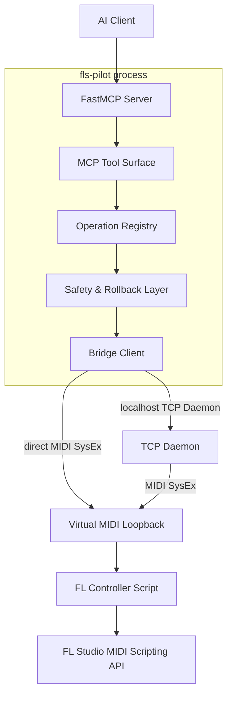

# Architecture Overview

This document is the human-readable orientation. The governed machine snapshot
is `agent-docs/machine/architecture-governance.snapshot.json`; consult it only under the
[Architecture Governance Contract](../contracts/architecture-governance.md).
Generated static analysis is split by coding scope under
`agent-docs/machine/architecture/`; start with
`agent-docs/machine/architecture/index.snapshot.json` when a task needs
generated architecture context.

## System Flow

The Control Center uses the daemon-hosted Runtime. Direct MCP transport can use
the in-process Runtime path. Both paths preserve the same
ownership model for project context, observations, reports, freshness, and
invalidation.

## Components

### AI Clients

Claude, ChatGPT, Cursor, Codex, or another MCP client starts or connects to the
FastMCP server over stdio or SSE/HTTP.

### FastMCP Server

`src/fls_pilot/server.py` is the MCP entry point. It registers public tools,
resources, and prompts. Public surface changes are architecture-governed.

### MCP Tool Surface

`src/fls_pilot/tools/` exposes consolidated domain tools and product workflows.
High-level tools are preferred over raw protocol-shaped wrappers. Registration
is centralized in `src/fls_pilot/server.py` and checked by
`scripts/check_tool_registration_baseline.py`.

### Operation Registry

`src/fls_pilot/operations.py` declares validated internal operations, safety
classes, snapshot/readback scopes, restore builders, and batch eligibility.
It is an internal orchestration surface, not a raw MCP escape hatch.

### Safety And Rollback Layer

`src/fls_pilot/safety.py` owns scoped snapshots, guarded writes, readback,
changelog records, and LIFO rollback. Persistent writes must use the approved
safety entry points.

### Bridge Client

`src/fls_pilot/connection.py` provides:

- `FLBridge` for direct MIDI SysEx communication.
- `TCPBridge` for communication through the localhost daemon.

The bridge transports validated commands; it does not replace tool-level
safety or approval.

### TCP Daemon And Runtime Host

`src/fls_pilot/daemon.py` owns MIDI I/O when the MCP client process cannot.
It also hosts `RuntimeCore`, whose strict RPC operations are declared in
`src/fls_pilot/runtime/protocol.py`. Raw command/code/script fields are
forbidden on the Runtime RPC surface. The daemon also owns durable Runtime jobs
and the offline Audio Analysis Worker. Those jobs do not access the FL bridge.

### Control Center

`src/fls_pilot/control_center.py` serves the local Control Center and calls the
daemon Runtime through `RuntimeClient`. Workflow panels consume declared
Runtime reports and job state directly; they must not invent independent
workflow state.

### Analysis Runtime

`src/fls_pilot/runtime/` owns canonical session/project context and report
storage. `src/fls_pilot/analysis/` owns observation collection, canonical
entities, evidence modes, scoring, freshness, report schemas, audio features,
and project-scoped evidence links.

### Knowledgebase

`knowledgebase/` stores verified FL API behavior, mappings, pitfalls, and
workflow guidance. Agents must use it instead of guessing values or ranges.

### Music Logic

`src/fls_pilot/music/` contains musical analysis, scales, processing recipes,
level logic, preset/plugin library reads, and MIDI export logic. It must not
bypass safety or protocol boundaries.

### Piano Roll Generated-Script Bridge

`src/fls_pilot/pianoroll.py`, `pyscript_gen.py`, and `pyscript_trigger.py`
generate `MCP_Apply.pyscript`, write it from the normal host process, and
trigger FL Studio's "run last script" shortcut. These writes are undo-backed
and have explicit readback limits.

### Virtual MIDI Loopback

loopMIDI on Windows or IAC Driver on macOS carries bidirectional SysEx between
the host process and FL Studio. Matching FL port numbers route controller
responses back to the host.

### FL Controller Script

`fl_controller/FLStudioPilot/device_FLStudioPilot.py` is the thin in-FL
adapter. It receives protocol commands, calls supported FL Studio APIs, and
returns responses and heartbeats.

### FL Studio API

The Image-Line MIDI scripting API is the final capability boundary. Missing,
unstable, or unverifiable API support must remain read-only, probe-only, or
manual.

## Trust Boundaries

- AI client to FastMCP server.
- MCP tool validation to internal operation execution.
- Safety layer to persistent FL project mutation.
- MCP server to localhost daemon.
- Host process to virtual MIDI.
- MIDI controller sandbox to the FL Studio API.
- Host process to generated Piano Roll script and OS-level trigger.
- User-provided audio/files to offline analysis/export code.

Changes to these boundaries require architecture review and may trigger the
human-approval STOP rule.

## Source Of Truth

- Public MCP registration: `src/fls_pilot/server.py`
- Internal operations: `src/fls_pilot/operations.py`
- Write safety: `src/fls_pilot/safety.py`
- Protocol commands: `src/fls_pilot/protocol.py`
- Controller handlers: `fl_controller/FLStudioPilot/device_FLStudioPilot.py`
- Runtime ownership: `src/fls_pilot/runtime/`
- Workflow declarations: `src/fls_pilot/workflows/registry.py`
- Analysis contract: `agent-docs/concepts/analysis-workflow-contract.md`
- Analysis report versioning:
  `agent-docs/contracts/report-versioning.md`
- Runtime job model:
  `agent-docs/contracts/runtime-job-model.md`
- Audio evidence:
  `agent-docs/contracts/audio-evidence.md`
- Degraded analysis behavior:
  `agent-docs/contracts/degraded-mode.md`
- Architecture governance:
  `agent-docs/contracts/architecture-governance.md`
- Governed machine snapshot:
  `agent-docs/machine/architecture-governance.snapshot.json`
- Scoped generated architecture snapshot index:
  `agent-docs/machine/architecture/index.snapshot.json`
- Full generated static analysis, for audits/releases/drift only:
  `agent-docs/machine/architecture-analysis.snapshot.json`
