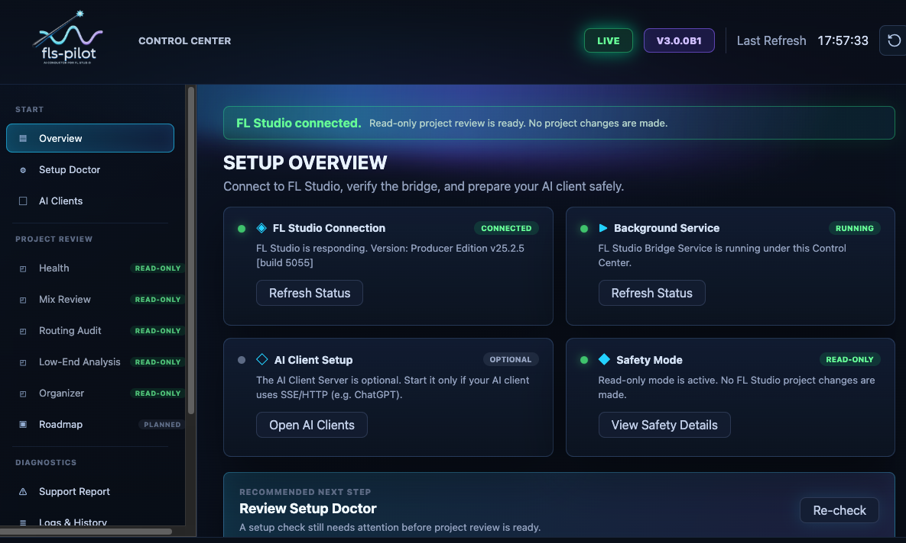
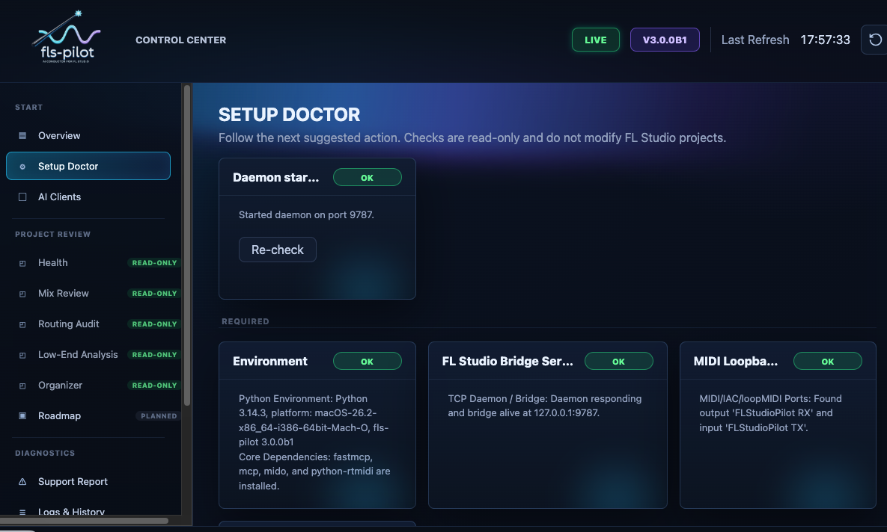
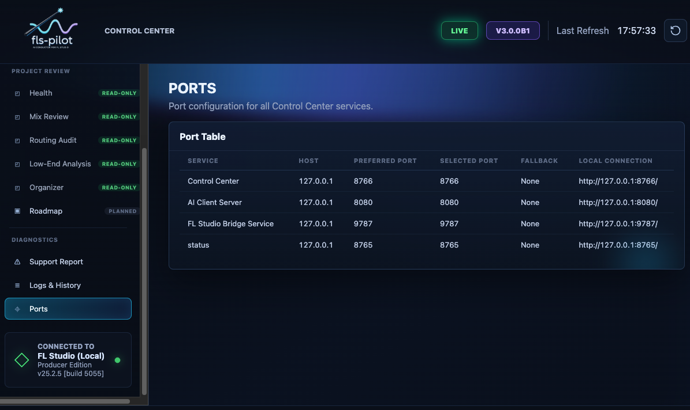
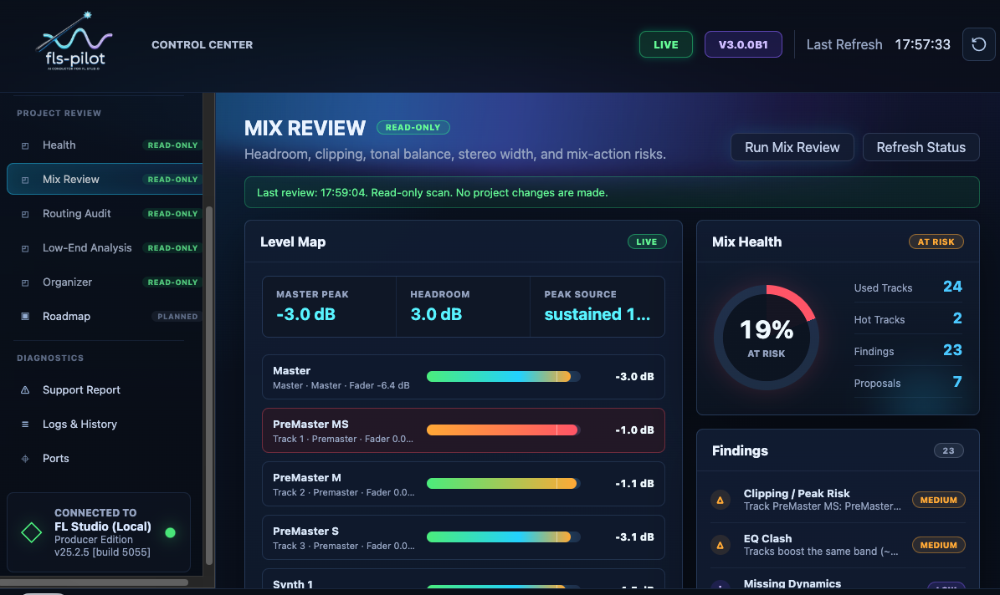
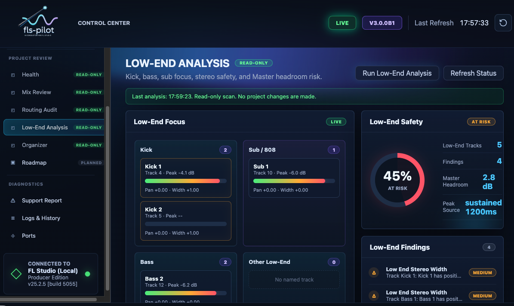

# Control Center

The Control Center is the recommended first-run and daily runtime surface for
fls-pilot. It opens locally, keeps setup checks read-only against the FL Studio
project, and shows the ports and MCP snippets your client should use.

Control Center is a UI over the local Runtime. It displays runtime status,
daemon and SSE state, MCP client snippets, the workflow catalog, workflow runs,
analysis reports, safety state, and long-running Runtime jobs such as audio
analysis. It consumes the same workflow/report contracts that MCP clients use.

## Guided Setup

Use the guided setup before connecting an MCP client or starting write-capable
workflows. It checks Python, dependencies, whether FL Studio is running,
virtual MIDI ports, the FL Studio controller heartbeat, daemon status, SSE
status, and the Piano Roll script bridge separately.

The checks are intentionally separated and ordered. Setup Doctor and Control
Center distinguish between three distinct states:

1. **FL Studio is not running** — the "Open FL Studio" action is shown first.
   The controller script check is skipped until FL Studio is open, so a missing
   heartbeat is never mistaken for a controller configuration problem.
2. **FL Studio is running but the controller is not connected** — the controller
   and heartbeat checks run and report the actual issue.
3. **Bridge or MIDI is not reachable** — reported as a separate finding.

A working MCP server does not prove that FL Studio is connected, and a running
daemon does not prove that the controller script is receiving MIDI.

## Dynamic Ports

Default local ports are Control Center `8766`, ChatGPT/SSE `8080`, and daemon
`9787`. If a port is busy, Control Center chooses a fallback and updates the
displayed URL and client snippets.

## Project Review Panels

After setup, Control Center provides read-only review panels for common
production checks.

Mix Review and Low-End Analysis help find headroom, clipping, bass, and stereo
risks before any edit is proposed.

Routing Audit and Organizer focus on structure: route health, bus layout,
names, colors, and cleanup candidates.

Project review panels show Runtime reports with their available evidence,
freshness, coverage, assumptions, and limitations. Static project metadata can
flag suspicious mix or routing conditions, but audio-backed claims require live
meter capture or a linked rendered audio artifact.

Mix Review exposes four evidence levels in the panel. Level 1 is the default
static review and does not start playback. Level 2 starts or reads a bounded
8-60 second peak watch for peak/headroom/clipping evidence. Level 3 and Level 4
let the user prepare rendered-master and stem/bus evidence requests, show linked
evidence status, and list the checks expected from the external analyzer path;
they do not claim LUFS, true peak, masking, phase, or spectrum facts in this
beta without analyzer results.

The Audio Evidence workflow uses `/api/audio-analysis` to run offline analysis
of user-selected files without modifying FL Studio projects or source audio.

Workflow actions remain safety-gated. Cleanup or write-capable follow-ups must
start with a read-only scan, propose one reversible action, wait for explicit
approval, read back supported state, and report rollback details.
