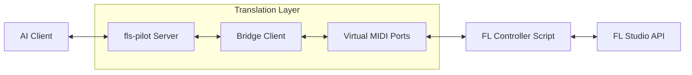

# Architecture Overview

fls-pilot is built as a bridge between MCP-compatible AI clients and FL Studio. It uses a custom MIDI scripting controller to safely interface with the DAW.

## How the Bridge Works

FL Studio exposes a Python-based MIDI Scripting API for hardware controllers. fls-pilot leverages this API by acting as a "virtual controller".

## Why MIDI and SysEx?

The FL Studio MIDI Scripting API is designed for MIDI messages. To pass complex data (like JSON configurations, channel lists, or plugin metadata) back and forth, fls-pilot encodes this data as MIDI System Exclusive (SysEx) messages.

This allows a high-bandwidth, reliable communication channel between the AI agent and the DAW without requiring any external plugins or memory hacks.

## Why Port 42?

We use Port `42` by convention to ensure that fls-pilot messages are correctly routed to our specific virtual controller script, preventing interference with your real hardware MIDI keyboards or control surfaces. Both the Input and Output ports must be set to the same number so the host and the DAW can talk bidirectionally.
