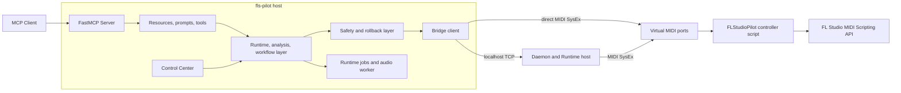

# Architecture Overview

fls-pilot is a local Runtime, workflow, and safety layer between
MCP-compatible AI clients and FL Studio. The MCP server exposes resources,
prompts, and high-level tools; the Runtime owns observations, workflow reports,
jobs, and evidence; the bridge carries validated FL commands to a thin FL
Studio controller script.

## System Flow

The Control Center uses the daemon-hosted Runtime for setup checks, workflow
panels, report state, and audio analysis jobs. Direct MCP clients can also use
an in-process Runtime path. Both paths preserve the same safety and report
contracts.

## Two Transport Layers

There are two independent transports:

| Layer | Purpose | Current options |
|---|---|---|
| MCP server transport | How an MCP client connects to fls-pilot. | stdio by default; SSE/HTTP when started with `--sse` or `FLS_PILOT_SERVER_TRANSPORT=sse`. |
| FL Studio bridge transport | How fls-pilot reaches the FL controller script. | Direct MIDI SysEx, or localhost TCP to the daemon, which then owns MIDI. |

`FLS_PILOT_TRANSPORT=tcp` selects the daemon-backed FL bridge path. It does
not change the MCP client transport. SSE is for MCP clients; daemon TCP is for
the local Runtime/bridge path.

## Main Components

### FastMCP Server

`src/fls_pilot/server.py` registers the public MCP resources, prompts, and
domain tools. Runtime agents should start with `fl://agent-briefing` and
`fl://status`, then prefer workflow and domain tools over low-level reads.

### Runtime, Workflows, And Reports

The Runtime owns current session/project context, workflow declarations,
observations, freshness, invalidation, workflow runs, reports, jobs, and
artifacts. Analysis workflows are not just tool calls. They produce
`fls-pilot.analysis-report.v1` reports with explicit evidence modes, coverage,
freshness, findings, assumptions, limitations, proposed changes, applied
changes, and safety metadata.

Project Health aggregates workflow reports. Mix Review, Low-End Analysis,
Routing Audit, Project Organizer, Preflight, and Audio Evidence use shared
report concepts so MCP clients and Control Center panels see the same contract.

### Control Center

The Control Center is the local UI over setup state, dynamic ports, daemon and
SSE status, the workflow catalog, report panels, safety state, and Runtime jobs
such as `/api/audio-analysis`. It consumes Runtime state; it should not invent
private workflow state.

### Safety And Rollback

The safe default is read-only scanning first. Persistent FL Studio project
writes require explicit approval, a scoped snapshot, the smallest practical
write, readback where supported, a changelog entry, and a rollback path. The
assistant should apply at most one reversible change, report before/after
details, then stop for user direction.

### Bridge, Daemon, Controller, And FL API

The bridge sends validated commands either directly over MIDI SysEx or through
the localhost daemon. The daemon can own MIDI I/O when an MCP client process
cannot and also hosts durable Runtime jobs. The FL controller script is a thin
adapter that receives protocol commands, calls supported FL Studio MIDI
scripting APIs, and returns responses and heartbeats.

FL Studio's MIDI scripting API remains the final capability boundary. Missing,
unstable, or unverifiable API support stays read-only, probe-only, or manual.

## Why MIDI And SysEx?

FL Studio exposes a Python-based MIDI Scripting API for hardware controllers.
fls-pilot uses that API by acting as a virtual controller. Complex payloads
such as JSON project summaries, mixer metadata, or plugin details are encoded
as MIDI System Exclusive messages so the host process and the controller script
can exchange structured data without external plugins or memory patching.

## Why Port 42?

Port `42` is only a convention for the FL Studio MIDI Settings port number. Any
number can work as long as the FLStudioPilot input and output entries use the
same value, so FL routes the controller script's outgoing SysEx back to the
host. Keeping one convention helps avoid accidental overlap with real MIDI
keyboards or control surfaces.

## Important API Limits

fls-pilot does not claim to automate everything in FL Studio. User-facing tools
must not load or insert plugins, place or edit playlist clips, delete patterns
or clips, open/new/save-as projects, render audio, expose raw controller
escape hatches, or promise full-FLP restore. Those actions remain manual unless
the FL API and the safety architecture are deliberately changed and reviewed.
