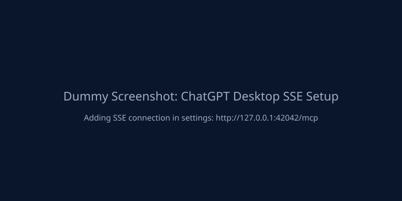
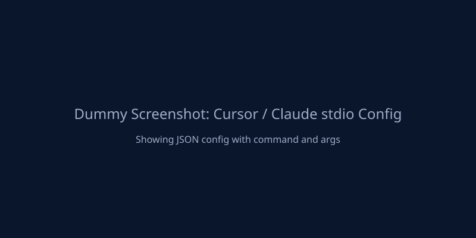

# MCP Integration

fls-pilot is built for MCP-compatible clients such as Claude Desktop, ChatGPT Desktop, Cursor, and other local MCP hosts. Users can ask in plain language, while integrators can call resources, prompts, and tools directly.

## Client Configuration

Control Center provides the exact configuration snippets needed for each client. Ensure you have completed the [Setup Guide](user-guide/setup.md) before connecting.

=== "ChatGPT Desktop (SSE)"

    ChatGPT Desktop requires an SSE connection.
    
    1. Open Control Center and start the SSE server.
    2. In ChatGPT Desktop, add an MCP connection using the provided SSE URL.
    3. The default URL is usually `http://localhost:8080/sse`, but rely on Control Center for dynamic port fallbacks.
    
    

=== "Claude Desktop (stdio)"

    Claude Desktop uses stdio connections. Configure the `fls-pilot` command in `claude_desktop_config.json`.
    
    ```json
    {
      "mcpServers": {
        "fls-pilot": {
          "command": "/path/to/fls-pilot/.venv/bin/fls-pilot",
          "env": {
            "FLS_PILOT_TRANSPORT": "tcp"
          }
        }
      }
    }
    ```
    
    

=== "Cursor (stdio)"

    Cursor uses stdio connections. Add the MCP server in Cursor settings.
    
    1. Name: `fls-pilot`
    2. Command: Path to your `.venv/bin/fls-pilot` executable.
    3. Ensure `FLS_PILOT_TRANSPORT=tcp` is passed in the environment if connecting via daemon.
    
    

=== "Generic MCP Host"

    Generic hosts can use either SSE or stdio. Control Center exposes both.
    Check the [Control Center](control-center.md) UI for the active URLs and command arguments.

!!! tip "Dynamic Port Fallback"
    If the default port is busy, Control Center will dynamically select a fallback port and display it in the UI. Always refer to the Control Center if connections fail.

## Recommended Agent Entry Points

Runtime agents should start with MCP context, not repository file reads:

| MCP surface | Purpose |
|---|---|
| `fl://agent-briefing` | Compact startup orientation, current tool families, safety rules, and stop rules. |
| `fl://status` | Bridge health, heartbeat age, FL version, tempo, and playback state. |
| `fl://channels`, `fl://mixer`, `fl://patterns` | Capped project summaries for first-pass orientation. |
| `fls://capabilities/supported` | Supported workflow categories. |
| `fls://capabilities/not-possible` | Hard API limits and manual workarounds. |
| `fls://capabilities/write-safety` | Approval gates and rollback-first write protocol. |

MCP prompts are available for guided workflows such as Mix Review, Routing Review, Project Organizer, Project Preflight, Plugin Chain Planning, Composition, and Audio Analysis.

## Domain Tools

Use high-level workflow and domain tools before low-level details:

| Area | Preferred tools |
|---|---|
| Transport | `fl_transport` |
| Mixer | `fl_mixer`, `fl_mixer_get_levels`, `fl_review_mix` |
| Channels | `fl_channel`, `fl_detect_unassigned_channels` |
| Patterns and playlist metadata | `fl_pattern`, `fl_playlist` |
| Plugins and effects | `fl_plugin`, `fl_effect`, `fl_setup_chain` |
| Piano Roll | `fl_piano_roll`, `fl_write_raga_melody`, `fl_write_raga_chords` |
| Project review | `fl_project_health_overview`, `fl_check_project_preflight` |
| Knowledgebase | `kb_search`, `kb_get`, `kb_get_workflow_pack`, `kb_explain_limit` |

!!! warning "Explicit User Approval"
    Write-capable tools still require explicit user approval before project mutation. A prompt or resource read is not approval to write.
