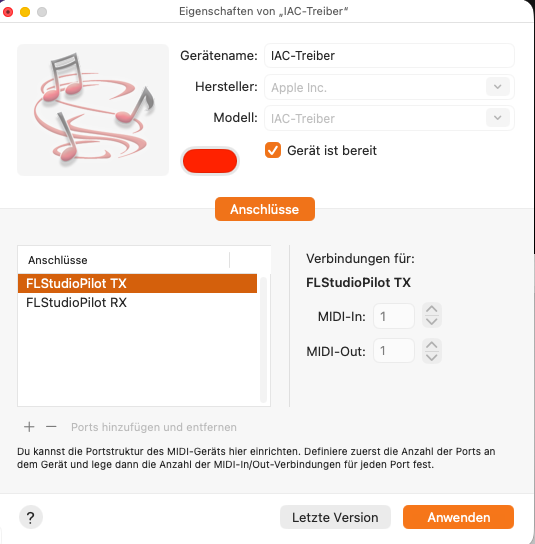
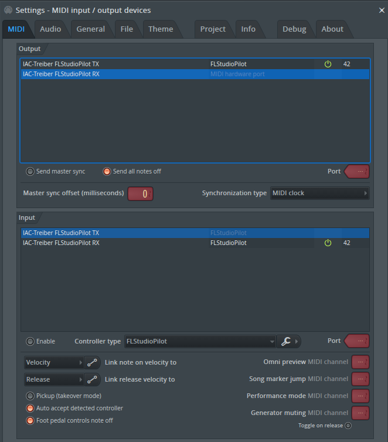
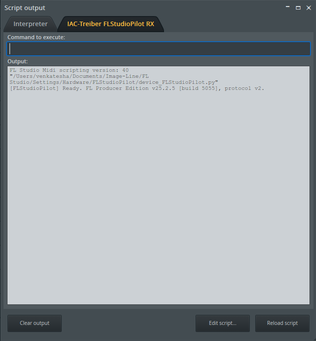
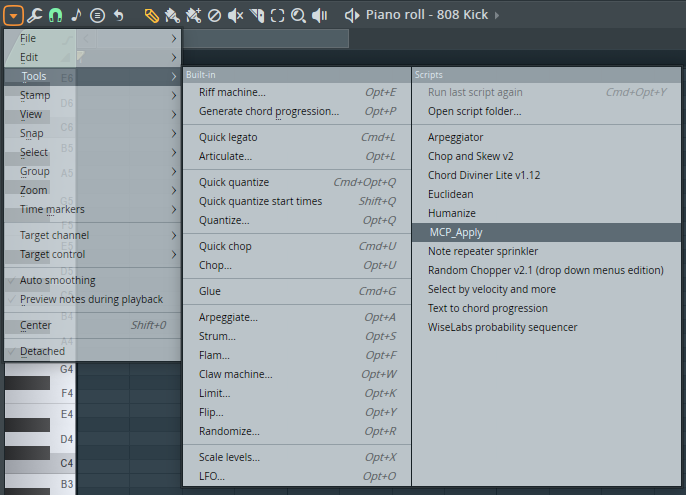

# Setup

This guide covers the normal setup path for FL Studio, the controller script,
the local fls-pilot server, and MCP clients.

## 1. Create Virtual MIDI Ports

Create two virtual MIDI ports named exactly:

- `FLStudioPilot RX`
- `FLStudioPilot TX`

On Windows, use loopMIDI. On macOS, use the built-in IAC Driver.



## 2. Install fls-pilot

Default editable installation:

```shell
git clone https://github.com/thunderdew-dawn/fls-pilot
cd fls-pilot
```

Windows:

```batchfile
scripts\install_windows.bat
```

macOS:

```shell
chmod +x scripts/install_macos.sh
./scripts/install_macos.sh
```

The installer copies the FL Studio controller script, installs the Python
server into `.venv`, checks the MIDI ports, and installs the Piano Roll
`MCP_Apply` script.

For a global CLI install, use `--pipx`:

```shell
./scripts/install_macos.sh --pipx
```

## 3. Configure FL Studio

Open **Options > MIDI Settings** and configure both ports with the same FL
Studio port number.



Use this setup:

| FL Studio list | Device | Required setting |
|---|---|---|
| Input | `FLStudioPilot RX` | Enable, Controller type `FLStudioPilot`, Port `42` |
| Output | `FLStudioPilot TX` | Enable, Port `42` |

Then open **View > Script output** and confirm the controller is ready.



## 4. Open Control Center

Recommended first-run command:

Windows:

```batchfile
.venv\Scripts\fls-pilot-control-center --open
```

macOS:

```shell
.venv/bin/fls-pilot-control-center --open
```

If installed with pipx, run:

```shell
fls-pilot-control-center --open
```

Control Center stays read-only against the FL Studio project while it checks
the environment and displays the correct MCP client snippets.

## 5. Connect an MCP Client

For stdio clients such as Claude Desktop or Cursor, configure the `fls-pilot`
command and set `FLS_PILOT_TRANSPORT=tcp` when using the daemon.

For ChatGPT Desktop, start the SSE server from Control Center and use the
displayed `http://localhost:<port>/sse` URL.

## 6. Arm Piano Roll Writes

Only composition tools need the Piano Roll bridge. Open the Piano Roll, choose
the script menu, and run **MCP_Apply** once per FL Studio session.



Read-only workflows such as Mix Review, Routing Audit, Project Health, and
Preflight do not require this step.

## Troubleshooting

| Symptom | Fix |
|---|---|
| MIDI ports are not detected | Recreate the ports with the exact names `FLStudioPilot RX` and `FLStudioPilot TX`. |
| No ready message in Script output | Confirm the controller type is `FLStudioPilot`, then restart FL Studio. |
| MCP client cannot reach FL Studio | Open Control Center, check daemon/SSE status, and verify `fl_transport(action="ping")`. |
| Note writing does nothing | Run `MCP_Apply` once from the Piano Roll script menu in the current FL session. |
| Audio analysis tools are unavailable | Install optional extras with `pip install -e ".[audio]"`. |
