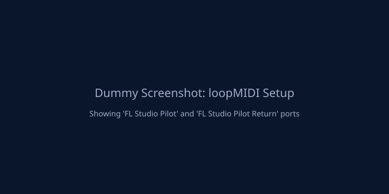
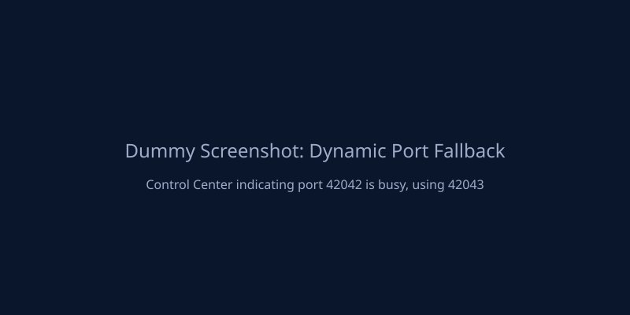

# Setup

This guide covers the normal setup path for FL Studio, the controller script, the local fls-pilot server, and MCP clients.

## 1. Create Virtual MIDI Ports & Install

Create two virtual MIDI ports named exactly:

- `FLStudioPilot RX`
- `FLStudioPilot TX`

=== "Windows"

    1. Use loopMIDI ([download](https://www.tobias-erichsen.de/software/loopmidi.html)) to create the two ports.
    
    

    2. Clone and install:
    ```batchfile
    git clone https://github.com/thunderdew-dawn/fls-pilot
    cd fls-pilot
    scripts\install_windows.bat
    ```
    *(Optional: Install `ffmpeg` on PATH for MP3 analysis)*

=== "macOS"

    1. Use the built-in **Audio MIDI Setup > IAC Driver** to create the two ports.
    
    

    2. Clone and install:
    ```shell
    git clone https://github.com/thunderdew-dawn/fls-pilot
    cd fls-pilot
    chmod +x scripts/install_macos.sh
    ./scripts/install_macos.sh
    ```
    *For a global CLI install, use `./scripts/install_macos.sh --pipx`*

The installer copies the FL Studio controller script, installs the Python server into `.venv`, checks the MIDI ports, and installs the Piano Roll `MCP_Apply` script.

## 2. Configure FL Studio

Open **Options > MIDI Settings** and configure both ports with the same FL Studio port number.


!!! important "Port Configuration"
    Use the exact port number `42` as standard practice for the connection.

| FL Studio list | Device | Required setting |
|---|---|---|
| Input | `FLStudioPilot RX` | Enable, Controller type `FLStudioPilot`, Port `42` |
| Output | `FLStudioPilot TX` | Enable, Port `42` |

Then open **View > Script output** and confirm the controller is ready.


## 3. Open Control Center

Control Center stays read-only against the FL Studio project while it checks
the environment and displays the correct MCP client snippets. It first checks
whether FL Studio is running — if not, it prompts you to open FL Studio before
testing the controller heartbeat or bridge. This prevents a missing heartbeat
from being confused with a controller configuration issue.

=== "Windows"
    ```batchfile
    .venv\Scripts\fls-pilot-control-center --open
    ```
=== "macOS"
    ```shell
    .venv/bin/fls-pilot-control-center --open
    ```
*(If installed with pipx, run `fls-pilot-control-center --open`)*

!!! note "Dynamic Port Fallback"
    If the default port is busy, Control Center will dynamically select a fallback port and display it in the UI.
    
    

## 4. Connect an MCP Client

Use the configuration snippets from the Control Center for your specific client.

=== "Claude Desktop / Cursor"

    For stdio clients, configure the `fls-pilot` command and set `FLS_PILOT_TRANSPORT=tcp` when using the daemon.
    
    

=== "ChatGPT Desktop"

    Start the SSE server from Control Center and use the displayed URL (e.g. `http://127.0.0.1:42042/sse`).
    
    

## 5. Arm Piano Roll Writes

Only composition tools need the Piano Roll bridge. Open the Piano Roll, choose the script menu, and run **MCP_Apply** once per FL Studio session.


Read-only workflows such as Mix Review, Routing Audit, Project Health, and Preflight do not require this step.

## Setup Success Checklist

Verify these steps before starting your first workflow:

- [ ] FL Studio is open with a project loaded
- [ ] Virtual MIDI Ports created and named correctly
- [ ] FL Studio MIDI settings configured (Controller type and Port 42)
- [ ] Controller heartbeat visible in FL Studio script output
- [ ] Control Center (Daemon/SSE) running without errors
- [ ] MCP Client successfully connected

## Troubleshooting

| Symptom | Fix |
|---|---|
| Setup Doctor shows "FL Studio Application" failed | Open FL Studio, load or create a project, wait until it is responsive, then click Re-check in Control Center. |
| MIDI ports are not detected | Recreate the ports with the exact names `FLStudioPilot RX` and `FLStudioPilot TX`. |
| No ready message in Script output | Confirm the controller type is `FLStudioPilot`, then restart FL Studio. |
| MCP client cannot reach FL Studio | Open Control Center, check daemon/SSE status, and verify `fl_transport(action="ping")`. |
| Note writing does nothing | Run `MCP_Apply` once from the Piano Roll script menu in the current FL session. |
| Audio analysis tools are unavailable | Install optional extras with `pip install -e ".[audio]"`. |
