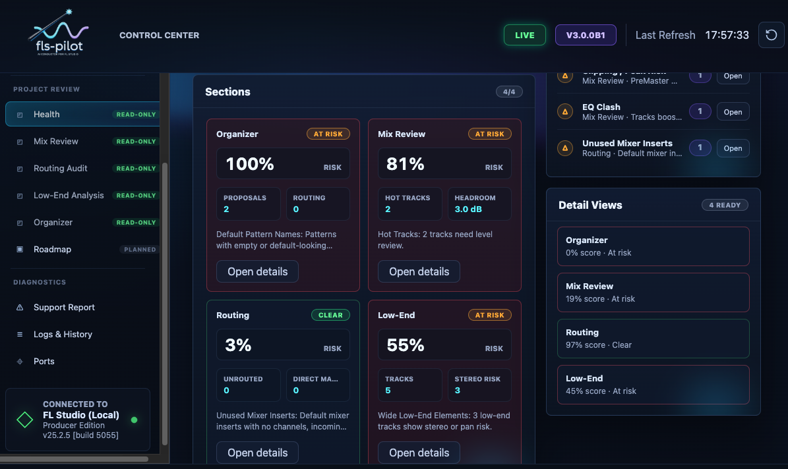
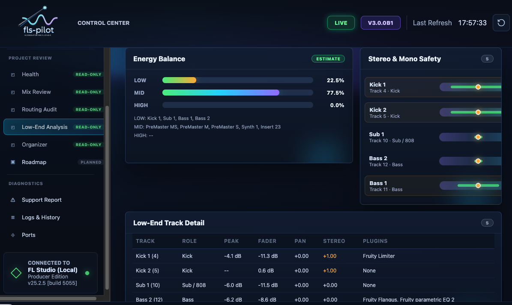
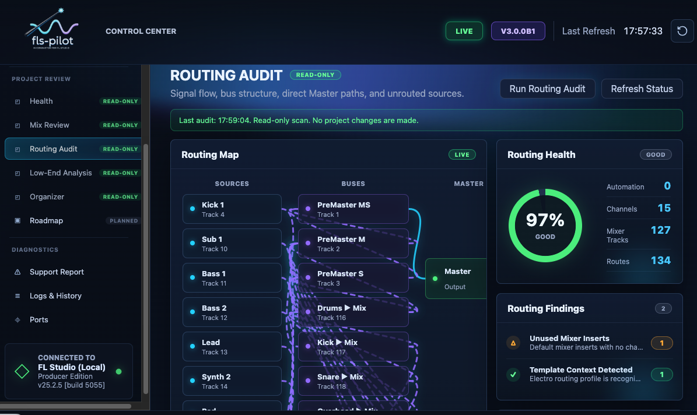
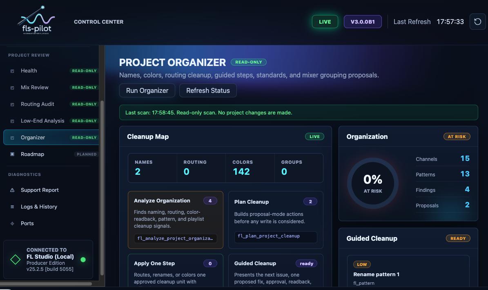
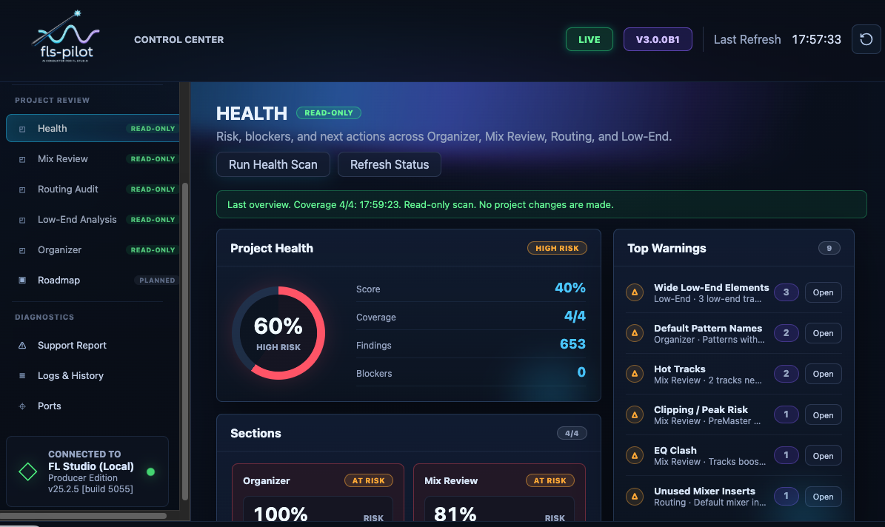

# Workflows

fls-pilot is designed around producer workflows rather than one-off API calls.
The safe default is read-only diagnosis first, then one explicit reversible
change only after approval.

## How it Works: 8 Production Phases

FL Studio's Python API is useful but has strict boundaries. This project combines safe controller calls, local file analysis, generated Piano Roll scripts, and a snapshot/rollback safety layer. The summary below explains what is automated and where FL Studio still requires manual action.

### Phase 1: Ideation & Composition (Notes & Audio)

**Audio Analysis (`fl_analyze_audio`, `fl_extract_melody`)**
- **The Limitation:** FL Studio's API cannot read or analyze audio files.
- **How it works:** These tools read `.wav` or `.mp3` files directly from disk and analyze them with Python libraries such as CREPE when the optional accurate audio extras are installed.

**Piano Roll & Scales (`fl_piano_roll`, `fl_scale_get`)**
- **The Limitation:** The API does not allow external programs to arbitrarily push notes directly into the Piano Roll at runtime.
- **How it works:** The assistant generates a temporary `MCP_Apply` script. A background daemon triggers the armed script with a keyboard shortcut (Cmd+Opt+Y on macOS), causing FL Studio to write the notes to the selected Piano Roll target.

### Phase 2: Arrangement & Structure

**Patterns & Playlist (`fl_pattern`, `fl_playlist`)**
- **The Limitation:** Direct editing, splitting, or moving of Audio/MIDI clips in the playlist is blocked by the API.
- **How it works:** The assistant manages supported structure such as pattern creation, pattern cloning where exposed, section markers, and track metadata through unified domain tools.

### Phase 3 & 4: Diagnosis & Preparation

**Audio Clip Safe Defaults (`fl_inspect_audio_clips`)**
- **The Limitation:** Deep Audio Clip features like "Stretch Pro" or the "Normalize" toggle are not exposed.
- **How it works:** The tools can apply safe Channel Rack volume limits, check for free mixer tracks, and generate manual checklists for Stretch/Normalize states that the FL API cannot verify.

**Project Organizer (`fl_channel`, `fl_mixer`, `fl_apply_color_standard`)**
- **Safety:** Renaming and coloring a large project uses scoped snapshots and named rollback units so supported changes can be audited and restored through the MCP safety layer.

### Phase 5: Signal Flow & Routing

**Routing Tools (`fl_review_routing`, `fl_apply_bus_layout`, `fl_group_tracks`)**
- **How it works:** Routing tools detect structural issues, propose bus layouts, and apply supported routing changes as named rollback units.

### Phase 6: Sound Design (The Strictest API Boundary)

**Chain Planner & Presets (`fl_setup_chain`, `fl_suggest_preset`)**
- **The Hard Limit:** It is technically impossible to load or insert a plugin via the FL Studio API.
- **The workflow:** The assistant scans FL Studio plugin database and preset folders on disk, suggests chains from what it finds, and can configure parameters after the user manually loads the chosen plugin.

### Phase 7: Mixing & Dynamics

**Mix Doctor (`fl_review_mix`, `fl_mix_watch_start`)**
- **The Limitation:** A static "snapshot" of a song is useless because audio is dynamic.
- **How it works:** During peak watch, the user plays the song while the tool polls live API peak meters and keeps running peak evidence for each track.

**Knowledgebase & Intents (`fl_apply_eq_intent`)**
- **The Problem:** AI notoriously "hallucinates" plugin parameter values (e.g. setting a knob to 150% when the limit is 100%).
- **How it works:** Before sending supported parameter changes to FL Studio, the assistant checks requested values against Knowledgebase conversion entries such as `kb_get_conversion` and sends normalized values within verified ranges.

### Phase 8: Export, Health & Safety

**Project Health Checks (`fl_check_project_preflight`)**
- **How it works:** Before a manual audio render, the assistant can run combined Mix Review, Routing Review, and cleanup checks to report export-readiness risks.

**Audio Export (`fl_export_midi`)**
- **The Limitation:** The API cannot click "Render to WAV".
- **How it works:** The tools write standard `.mid` files directly to disk for arrangement exports. Audio bouncing remains manual.

**The Safety Layer (`fl_rollback_last_change`)**
- **The Limitation:** FL Studio's native Undo (Ctrl+Z) is highly unreliable for API scripts.
- **How it works:** The MCP safety layer stores scoped snapshots and changelog entries for supported writes. Calling rollback restores the affected supported state through the MCP rollback path.

---

## Detailed Examples

## Mix Review

Mix Review reads live mixer and project context to find clipping, headroom,
balance, routing, and low-end risks.



<video controls muted playsinline preload="metadata" style="width: 100%; max-width: 960px;">
  <source src="../../assets/ai-apply-gain-staging-example.mp4" type="video/mp4">
</video>

Use prompts like:

```text
Scan my mix first. Do not change anything yet. Tell me the safest next action.
```

## Low-End Analysis

Low-End Analysis focuses on bass/sub structure, mono compatibility, suspicious
stereo width, and master headroom.



## Routing Audit

Routing Audit reviews mixer routes, bus structure, channels that skip groups,
and fragile send/return layouts. Cleanup remains proposal-first.



<video controls muted playsinline preload="metadata" style="width: 100%; max-width: 960px;">
  <source src="../../assets/ai-based-mixer-routing-example.mp4" type="video/mp4">
</video>

## Project Organizer

Project Organizer finds naming, color, grouping, and routing cleanup
candidates. It can propose one reversible cleanup step at a time.



<video controls muted playsinline preload="metadata" style="width: 100%; max-width: 960px;">
  <source src="../../assets/ai-color-my-tracks-example.mp4" type="video/mp4">
</video>

## Plugin and EQ Workflows

fls-pilot can inspect already-loaded plugins and configure supported parameters
when parameter ranges are known. It cannot load or insert plugins.

<video controls muted playsinline preload="metadata" style="width: 100%; max-width: 960px;">
  <source src="../../assets/ai-set-highpass-on-eq-batch-example.mp4" type="video/mp4">
</video>

## Composition

Composition tools can generate scale-aware melodies, chords, and patterns. The
assistant should preview notes first and wait for approval before writing to
the Piano Roll.

<video controls muted playsinline preload="metadata" style="width: 100%; max-width: 960px;">
  <source src="../../assets/ai-generate-bassline-example.mp4" type="video/mp4">
</video>

## Project Health and Preflight

Project Health combines mix, routing, organization, and export-readiness checks
into a single read-only overview.



## Safe Operating Pattern

For any workflow that might write to FL Studio:

1. Scan first.
2. Explain the finding.
3. Propose one reversible action.
4. Ask for explicit approval.
5. Apply one rollback unit.
6. Report before/after and rollback details.
